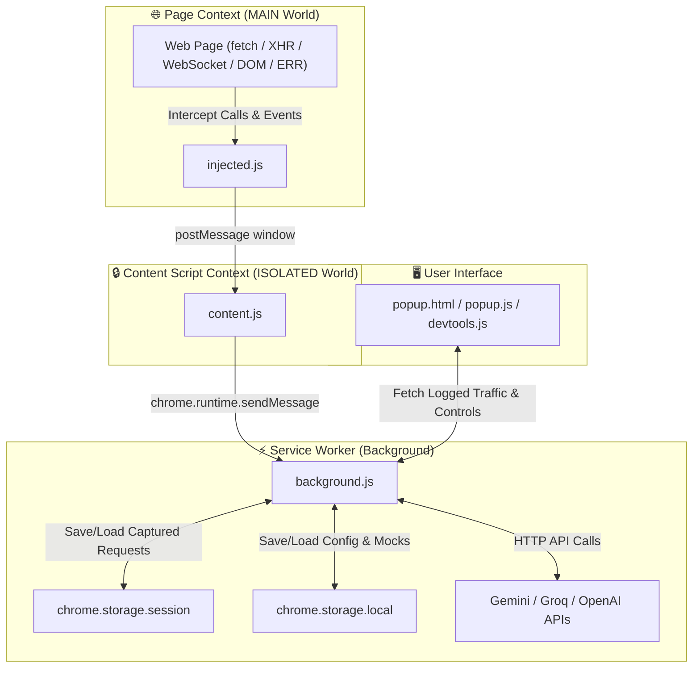

# 🛠️ TDM Web Dev Inspector & Multi-AI Suite (v2.0)

> An advanced, all-in-one Chrome Manifest V3 extension designed for web developers, API engineers, performance analysts, and security auditors. Inspect network traffic (`fetch`, `XHR`, `WebSocket`), mock APIs, rewrite headers, perform AI security audits, analyze performance waterfalls, and replay requests directly within tab contexts.

---

## 📑 Table of Contents

- [Overview](#-overview)
- [Architecture & Data Flow](#-architecture--data-flow)
- [Core Features & Usage](#-core-features--usage)
  - [1. Web Traffic & Event Interceptor](#1-web-traffic--event-interceptor)
  - [2. Multi-Provider AI Engine & Security Auditor](#2-multi-provider-ai-engine--security-auditor)
  - [3. Header Rewriter Engine (ModHeader Alternative)](#3-header-rewriter-engine-modheader-alternative)
  - [4. Advanced Mock Interceptor & Latency Simulator](#4-advanced-mock-interceptor--latency-simulator)
  - [5. Waterfall Performance Studio & Analytics](#5-waterfall-performance-studio--analytics)
  - [6. JSON Tree Viewer & Path Extractor](#6-json-tree-viewer--path-extractor)
  - [7. Multi-Language Code Snippet Generator](#7-multi-language-code-snippet-generator)
  - [8. Side-by-Side Request Diff Tool](#8-side-by-side-request-diff-tool)
  - [9. API Test Runner & K6 Exporter](#9-api-test-runner--k6-exporter)
  - [10. Storage & Cookie Manager](#10-storage--cookie-manager)
  - [11. In-Tab Request Replay Engine](#11-in-tab-request-replay-engine)
- [File & Code Base Structure](#-file--code-base-structure)
- [Installation & Quick Start](#-installation--quick-start)
- [Important Technical Details to Know](#-important-technical-details-to-know)
- [Troubleshooting & FAQ](#-troubleshooting--faq)

---

## 🔍 Overview

**TDM Web Dev Inspector** transforms your Chrome browser into a developer studio. Unlike basic network loggers, it injects hooks into the main page window context to capture raw requests, WebSockets, DOM interactions, and JavaScript errors in real-time, while providing powerful inline tools:

* **Dual Interface**: Operate via a **Standalone Popup Window** or directly inside **Native Chrome DevTools (F12)**.
* **Multi-AI Engine**: Connect your own **Google Gemini**, **Groq AI**, or **OpenAI** API keys.
* **Full Inspection Lifecycle**: From interception and manipulation (headers/mocks) to analysis (diff/waterfall/AI security audit) and exporting (code snippets/K6 load tests).

---

## 🏗️ Architecture & Data Flow

The extension follows Chrome Extension Manifest V3 architecture with isolated script contexts:



### Data Pipeline Workflow:
1. **Interception (`injected.js` - MAIN World)**: Hooks global `window.fetch`, `XMLHttpRequest.prototype`, `window.WebSocket`, DOM event listeners (`click`, `DOMContentLoaded`, `load`), and error handlers (`onerror`, `unhandledrejection`).
2. **Bridge Relay (`content.js` - ISOLATED World)**: Listens for `window.postMessage` from `injected.js` and forwards captured request metrics to `background.js` using `chrome.runtime.sendMessage`.
3. **Session Persistence (`background.js` - Service Worker)**: Buffers captured requests per tab ID (up to 200 items per tab) in `chrome.storage.session`.
4. **UI Rendering (`popup.js` / DevTools Panel)**: Queries `background.js` for tab-specific request data, renders log tables, waterfalls, diffs, and handles user actions.

---

## 💡 Core Features & Usage

### 1. Web Traffic & Event Interceptor
- **Monitored Traffic**: HTTP `fetch`, `XMLHttpRequest` (XHR), `WebSocket` connections, DOM events (clicks, loads), and uncaught JS Errors/Rejections.
- **Controls**: Pause capture, filter by HTTP method (`ALL`, `GET`, `POST`, `PUT`, `DELETE`, `WS`, `DOM`, `ERR`), search by URL, or clear captured logs.

### 2. Multi-Provider AI Engine & Security Auditor
- **Supported Providers & Models**:
  - **Google Gemini**: `gemini-3.8-flash` (Default), `gemini-3.8-pro`, `gemini-2.5-flash`, `gemini-2.5-pro`
  - **Groq AI**: `qwen/qwen3.8-27b` (Default), `llama-3.1-8b-instant`, `llama-3.1-70b-versatile`, `deepseek-r1-distill-llama-70b`
  - **OpenAI**: `gpt-4o-mini` (Default), `gpt-4o`, `gpt-4-turbo`
- **OWASP Security Auditor**: Scans captured request headers, authorization tokens, and payloads for security leaks (exposed JWTs, missing `Content-Security-Policy`/`HSTS`, PII data leaks).
- **Context Menus**: Right-click any web page, highlighted text, or image to ask the AI assistant for immediate explanations.

### 3. Header Rewriter Engine (ModHeader Alternative)
- Add, update, or remove HTTP request headers matching targeted URL patterns (`Contains`, `Exact Match`, or `Regex`).
- Header rules persist across sessions and take effect immediately.

### 4. Advanced Mock Interceptor & Latency Simulator
- Intercept matching `fetch` and `XHR` calls without modifying page source code or needing a mock server.
- Configure HTTP Method, Match Type (`Contains`, `Exact`, `Regex`), HTTP Status Code (e.g., `200`, `404`, `500`), artificial latency delay in milliseconds, custom response headers, and mock response bodies.

### 5. Waterfall Performance Studio & Analytics
- Gantt chart timeline rendering request latencies.
- Automatic color-coded visual indicator:
  - 🟢 **Fast**: `< 100 ms`
  - 🟡 **Medium**: `< 500 ms`
  - 🔴 **Slow**: `> 500 ms`
- Displays overall network metrics: total transferred size, total request count, average latency, and error rate %.

### 6. JSON Tree Viewer & Path Extractor
- Interactive tree format for JSON request & response payloads.
- Click any key or property to copy its precise dot-notation path (e.g., `data.users[0].id`) directly to your clipboard.

### 7. Multi-Language Code Snippet Generator
- Instantly convert any captured network request into functional code in 6 languages:
  1. **JavaScript**: `fetch()`
  2. **cURL**: Ready-to-run terminal command (Postman compatible)
  3. **Python**: `requests` / `httpx`
  4. **Node.js**: `axios`
  5. **Go**: `net/http`
  6. **Rust**: `reqwest`

### 8. Side-by-Side Request Diff Tool
- Select any two captured requests (**Base** vs **Compare**) to view side-by-side differences across URL parameters, request headers, and request bodies highlighted in green (added/changed) and red (removed).

### 9. API Test Runner & K6 Exporter
- Automated status assertion suite executed against all captured endpoints.
- Export captured API sessions as a ready-to-run **K6 Load Testing script** (`k6_script.js`).

### 10. Storage & Cookie Manager
- Inspect active cookies for the currently active tab domain.
- Clear domain cookies with a single click to simulate fresh unauthenticated user sessions.

### 11. In-Tab Request Replay Engine
- Re-send or modify captured requests inside the target tab's active execution context (`MAIN` world).
- Guarantees authentic session cookies, `Origin` headers, and local storage state are included in replayed calls.

---

## 📂 File & Code Base Structure

```
TDM_WEB_DEV_EXT_ADV/
├── manifest.json         # Chrome Extension Manifest V3 configuration
├── background.js         # Service Worker (State manager, AI dispatcher, script executor)
├── content.js            # Isolated World Content Script (Message bridge to background)
├── injected.js           # Main World Script (Hooks fetch, XHR, WS, DOM events, Errors, Mocks)
├── popup.html            # Main UI HTML layout (Inspector window & DevTools panel view)
├── popup.js              # UI Logic, event listeners, tab renderers, diff viewer, test runner
├── popup.css             # Main UI theme, layout, dark-mode styles
├── chatbot-widget.js     # Floating Multi-AI Chatbot Widget (Shadow DOM isolated)
├── styles.css            # Styles for chatbot widget & components
├── devtools.html         # Chrome DevTools panel registration container
├── devtools.js           # Registers "TDM Inspector" panel in DevTools (F12)
├── USER_GUIDE.md         # Detailed end-user instruction guide
├── README.md             # Technical overview & developer documentation (this file)
└── anime_icon.ico        # Extension icon
```

---

## 🚀 Installation & Quick Start

1. Clone or download this project repository.
2. Open Google Chrome and go to `chrome://extensions`.
3. Enable **Developer Mode** using the toggle switch in the top-right corner.
4. Click **Load unpacked** and select the extension directory (`TDM_WEB_DEV_EXT_ADV`).
5. Open any webpage, then:
   - Click the extension icon in your Chrome toolbar to open the **Standalone Inspector**.
   - OR press `F12` (Inspect Element) and select the **TDM Inspector** tab.

---

## ⚙️ Important Technical Details to Know

1. **Main World Execution (`world: "MAIN"`)**:
   `injected.js` runs directly inside the target web page's JavaScript execution context (`MAIN` world). This allows it to patch `window.fetch`, `XMLHttpRequest`, and `WebSocket` constructors that webpage scripts invoke.

2. **Isolated World Security (`world: "ISOLATED"`)**:
   `content.js` runs in Chrome's `ISOLATED` world to safely handle Chrome Extension APIs (`chrome.runtime.sendMessage`, `chrome.storage`) without exposing extension privileges or keys to malicious web scripts.

3. **Secure Local API Key Storage**:
   AI Provider keys (Gemini, Groq, OpenAI) are saved exclusively in `chrome.storage.local`. They are **never stored in webpage `localStorage`** or transmitted to any middleman server; completions are sent directly from the background service worker to the official provider endpoints.

4. **Session Buffer & Truncation**:
   - Request history is tab-isolated and limited to **200 requests per tab** in `chrome.storage.session` to prevent browser memory leaks.
   - Large request/response bodies are truncated to **8,000 characters** for log previews, preserving overall UI responsiveness.

5. **Mock Interception Timing**:
   Mock rules are evaluated inside `injected.js` before network requests leave the browser. Mock responses synthesize standard `Response` / `XMLHttpRequest` objects with simulated delay.

---

## ❓ Troubleshooting & FAQ

* **Q: The AI Assistant returns an error.**
  * *Fix*: Click **⚙️ Settings** in the AI Assistant widget, select your active provider (Gemini, Groq, or OpenAI), ensure a valid API key is entered, and click **Save Settings**.

* **Q: Mock rules are not triggering on my requests.**
  * *Fix*: Verify the mock rule toggle is **ON**, check that the HTTP Method matches (`ALL` matches any method), and confirm the URL match pattern matches the target URL.

* **Q: Traffic on `chrome://` or Chrome Web Store pages is not captured.**
  * *Fix*: Chrome security policies block extension content script injection on native browser pages (`chrome://*`) and the Chrome Web Store. Capture works on all standard web URLs.
